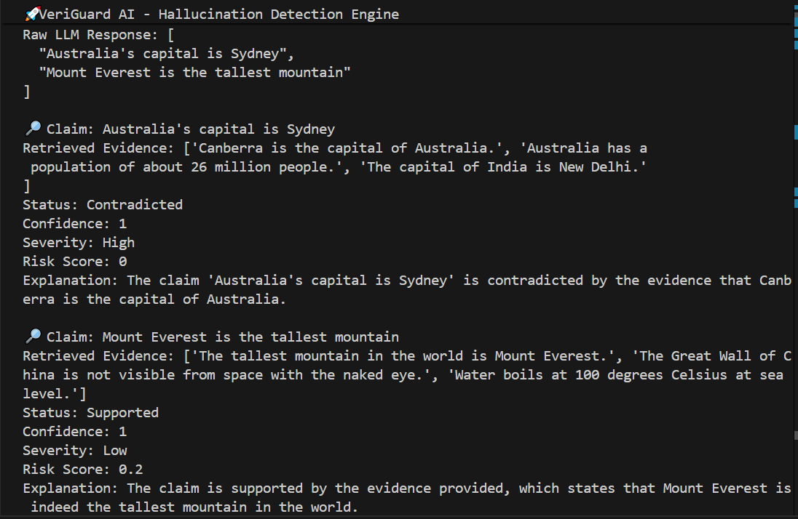

# 🔐 VeriGuard AI – LLM Hallucination Detection & Verification Engine

**Tech Stack:** Python, FAISS, Sentence-Transformers  
**Architecture:** Hybrid Retrieval + LLM Verification  

---

## 📌 Overview

VeriGuard AI is a retrieval-based hallucination detection engine designed to verify factual claims generated by Large Language Models (LLMs).

It acts as a **trust layer** for AI systems by:

- Extracting factual claims from generated text
- Retrieving semantically similar evidence using FAISS
- Verifying claims against retrieved evidence
- Assigning hallucination risk scores
- Classifying severity levels

This system demonstrates applied AI engineering principles by combining vector search, local embeddings, and LLM reasoning.

---

## 🎯 Problem

LLMs can confidently generate:

- Fabricated historical events  
- Incorrect numerical values  
- False geographic claims  
- Invented laws or citations  
- Subtle factual distortions  

Most AI pipelines publish this output without verification.

VeriGuard AI introduces structured verification before deployment.

---

## 🏗️ System Architecture

LLM Output  
↓  
Claim Extractor (Groq)  
↓  
Embedding Generator (Sentence-Transformers)  
↓  
FAISS Vector Index (Local Knowledge Base)  
↓  
Top-K Evidence Retrieval  
↓  
LLM Claim Verifier (Groq)  
↓  
Risk Scoring Engine  
↓  
Structured Verification Report  

---

## 🛠️ Methodology

### 1️⃣ Claim Extraction

The system uses Groq LLM to extract factual claims while ignoring opinions.

Example:

Input:
```
Australia's capital is Sydney. Mount Everest is the tallest mountain.
```

Extracted Claims:
```
[
  "Australia's capital is Sydney",
  "Mount Everest is the tallest mountain"
]
```

---

### 2️⃣ Semantic Retrieval (FAISS)

- Knowledge base documents are embedded using `all-MiniLM-L6-v2`
- Embeddings are indexed with FAISS
- For each claim, top-K semantically similar passages are retrieved

This enables semantic similarity search instead of keyword matching.

---

### 3️⃣ LLM-Based Verification

Each claim is compared against retrieved evidence using Groq.

Classification categories:

- Supported
- Contradicted
- Unverifiable

The model also returns:

- Confidence score (0–1)
- Explanation

---

### 4️⃣ Risk Scoring Engine

Verification results are converted into risk metrics:

| Status        | Severity | Risk Score Logic      |
|--------------|----------|-----------------------|
| Supported    | Low      | 0.2                   |
| Unverifiable | Medium   | 0.6                   |
| Contradicted | High     | 1 - confidence        |

This transforms reasoning into structured risk evaluation.

---

## 📊 Example

Input:
```
The capital of Australia is Sydney.
```

Output:
## 📸 Demo

Below is a sample run of VeriGuard AI detecting hallucinated claims:

<p align="center">
  
</p>

---

## ⚙️ Tech Stack

- Python
- FAISS (Vector Similarity Search)
- Sentence-Transformers (Local Embeddings)
- Groq LLM API
- python-dotenv

---

## 🎯 Key Features

- Hybrid verification (retrieval + LLM reasoning)
- Local embedding index using FAISS
- Modular backend architecture
- Risk quantification engine
- Semantic similarity search
- Production-oriented structure

---

## 🔮 Future Improvements

- Larger Wikipedia-based knowledge base
- Numeric drift detection module
- Internal contradiction detection
- Citation verification system
- JSON batch evaluation mode
- Web dashboard interface
- API deployment using FastAPI

---

## 👤 Author

Keerthi Adapa  
GitHub: https://github.com/Devikeerthi000  
Email: keerthiadapa70@gmail.com  